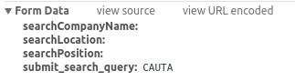

### Stack Overflow

If you ever did any serious coding, there is 0 percent chance that you missed the one and only stackoverflow, home to all the answers a dev may seek. Their [yearly survey](http://stackoverflow.com/research/developer-survey-2016) reveals some interesting facts about the community: [only 35% have a bachelor's degree](http://stackoverflow.com/research/developer-survey-2016#developer-profile-education) or [Germans value work-life balance slightly more than their salary](http://stackoverflow.com/research/developer-survey-2016#work-job-priorities).

What really caught my eye was the [Purchasing Power Table](http://stackoverflow.com/research/developer-survey-2016#purchasing-power-per-country); I think it's the first time I have encountered the [Big Mac Index](http://www.economist.com/content/big-mac-index). Not to be taken too seriously, it just gives you a basic idea of how much your local salary would be worth, or, putting it in other words, how many Big Macs you can buy with it.

Probably the most relevant was this [graph](http://stackoverflow.com/research/developer-survey-2016#money-matters-more-in-some-countries), showing Eastern European discontent with their economic situation - top three countries that care the most about their salary are the Ukraine, Poland and Romania. There is of course a clear correlation between average pay and how important benefits are - the lower the pay, the likelier they value money more.

### The home front

If you are interested in Romania's situation in the IT world, take a look at this [Forbes article](http://www.forbes.com/sites/stephenmcgrath/2016/05/26/romanias-silicon-valley-has-an-innovation-problem/#40dfe6675eed). If not, I'll still let you know that developers are probably the best paid employees of the land and they are still relatively cheap compared to their western counterparts, so there is no need to fear that you might end up jobless with a passion for coding.

Last year, one of my colleagues was kind enough to bring my attention to [cash-it.xyz](http://cash-it.xyz), a page that hosts anonymous salary reports of the Romanian IT sector. It's a win-win for both employers and employees - employers can have a better understanding of what the competition has to offer, while employees can get a better estimate of their true worth on the market.

It's amazing to see the community in action: a little less than a 1000 reports are present for the whole country, a third being from Bucharest and another third from Cluj.

### Obtaining data

This is great and all, but I want to see this pile of data from another perspective. Charts would be especially neat. Let's see what Chrome dev view can offer us!

Oh great, check this out! A JSON!


Not the one. It's just used to autocomplete your queries. Let's look some more:



Aha, now we're getting warmer. So if I do a POST to cash-it.xyz with these parameters, I should be getting an HTML with a table containing precious data. Let's fire up Postman and test it.


Nope, this won't work, the table is empty. What am I missing? 

Time to use Wireshark to find out what happens when I hit the Search button in the form:


Cool, let's try POSTing with Postman again:


The difference is pretty obvious: Postman sends the request with `multipart/form-data`, while Chrome does it with `application/x-www-form-urlencoded`. The difference is explained [here](http://stackoverflow.com/questions/4007969/application-x-www-form-urlencoded-or-multipart-form-data). After a bit of fiddling, it works like a charm with Postman as well.


### Script it!

Now that we have a way of fetching data, time to display it. Weapon of choice: __Python__ and __matplotlib__.

Some code to make the `application/x-www-form-urlencoded` request:

```
url = 'http://46.101.181.43'
values = {'searchCompanyName' : '',
          'searchLocation' : '',
          'searchPosition' : '',
          'submit_search_query' : 'CAUTA' }

data = urllib.urlencode(values)
req = urllib2.Request(url, data)
response = urllib2.urlopen(req)
the_page = response.read()
```

An HTML parsing library would be pretty neat. _Lucky me that I'm doing this in Python_: `pip install beautifulsoup4`


There is a Python library for everything. _Life is great._

About this much is enough to put all salaries in vector y:

```
y = []

soup = BeautifulSoup(the_page, 'html.parser')
rows = soup.find(id='companyTable').find('tbody').find_all('tr')

for row in rows:
	cols = row.find_all('td')
	cols = [ele.text.strip() for ele in cols]
	y.append(int(cols[1]))

y = sorted(y)
```

Now let's plot this thing:

```
x = range(1, len(y) + 1)
plt.plot(x, y)
plt.xlabel('Reports')
plt.ylabel('Salary (RON)')
plt.title('Salaries reported on cash-it.xyz')
plt.grid(True)
plt.show()
```

I think I like what I'm seeing.


